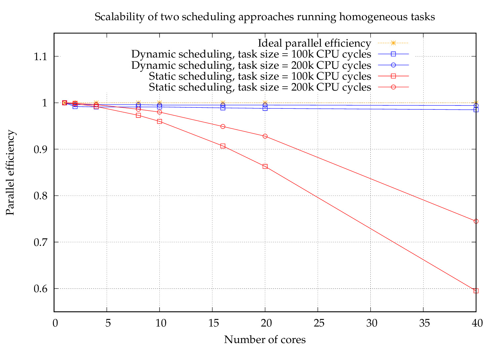
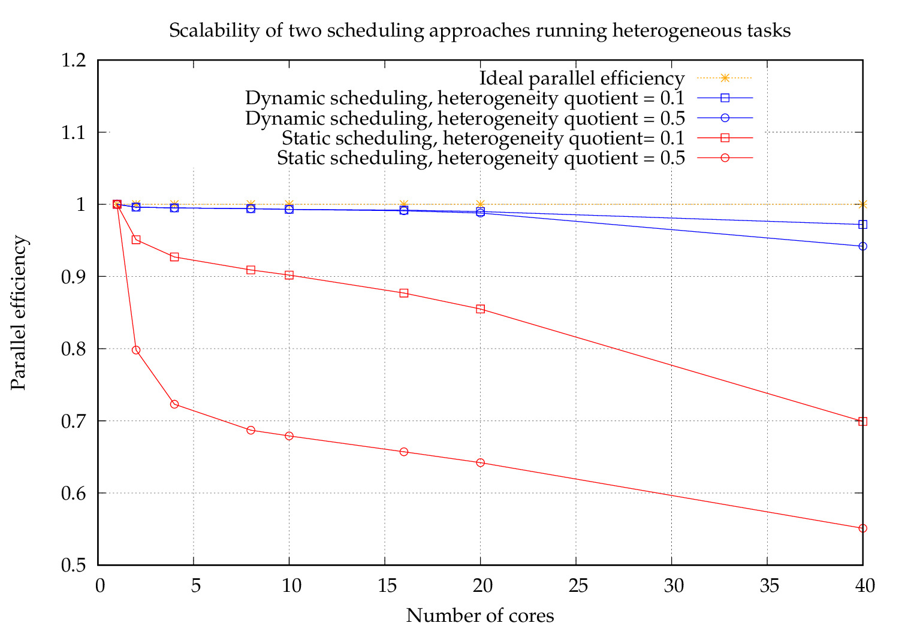

The free lunch is over - the end of Moore’s Law means we have to use more
cores instead of faster cores. The massive increase in on-node parallelism is
also motivated by the need to keep power consumption in balance.
Latest architecture have up to hundreds of cores on the node. Efficiently using that
amount of parallelism, requires a paradigm shift: we must develop new effective
and efficient parallel programming techniques to allow the usage of all parts in
the system efficiently. A popular way to speed up application execution in multi-core machines is task parallelism, 
Key requirements are to have strong scalability, efficiency and dynamic resource management.

Scientific computing applications often involve an iterative step which is run
until the desired convergence. A trivial parallelization of these iterative methods
would be to apply a global barrier at the end of the iterative loop. This ensures
that all the parallel resources synchronize at this point, so that the intended
computations can be done in the next iterations accurately. Numerical solution
of the partial differential equations generate stencils which captures the dependency of
the underlying computation. These stencils often have dependency on neighboring grids only. 
Therefore, the global barrier is not required to synchronise the computations, and 
synchronizations with the neighboring sub-domain often suffices. This can be achieved 
by introducing local barriers across the neighboring sub-domains. The task working on
a sub-domain can proceed with its computation in an iteration as soon as all the neighbors
have reached this iteration. The local synchronization does not require all the tasks to
be working in the same iterations. Instead as per their workload and local dependencies,
the tasks on different sub-domains can operate on different iterations at a given
point in time. This allows to avoid potential aggregations generated by the load
imbalance. In this work, we compare the two strategies to schedule tasks in the
shared memory parallel environment:

• Static scheduling using global synchronization at the end of the iterative loop.

• Dynamic scheduling using local synchronization with nearest neighbors.

We run 10k iterations, each running 80 tasks in our experiments. We examine the 
parallel efficiency using homogeneous and heterogeneous tasks respectively. 

We observe that the dynamic scheduling retains the parallel efficiency greater than 98% even for
40 cores. However, the static scheduling performance deteriorates starting from
8 cores and goes all the way down to 60% for 40 cores. Clearly, the global
barriers limit the parallel efficiency and it effect becomes severe for more cores.
Also, the parallel efficiency deterioration is observed to be more severe for fine
granular tasks, i.e. using the task duration of 100k CPU cycles. This is due to
global barrier based synchronization overheads, which becomes more prominent for fine granular tasks.

We observe that using the dynamic scheduling, both the heterogeneous task distributions,
retain the parallel efficiency greater than 94% even for 40 cores. However, the
static scheduling performance deteriorates starting from just 2 cores and goes
all the way down to 55% for 40 cores. The global barriers introduce more
waiting times for the parallel resources working on heterogeneous tasks. This
effect becomes severe in the tasks with more heterogeneity. On the other hand,
the dynamic scheduling with local synchronization allows to recover the waiting
time of the resources by assigning them more fine granular tasks. It has handled
the extreme load imbalance, where the task distribution varies from 100k cycles to 300k. 

The keytakeaway is : the global synchronization destroys the parallel efficiency of 
the scientific applications. Wherever possible, we should use the local synchornization 
across the subdomains and avoid global synchornizations.
